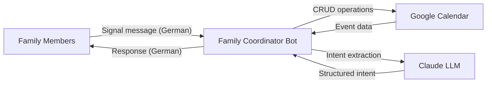
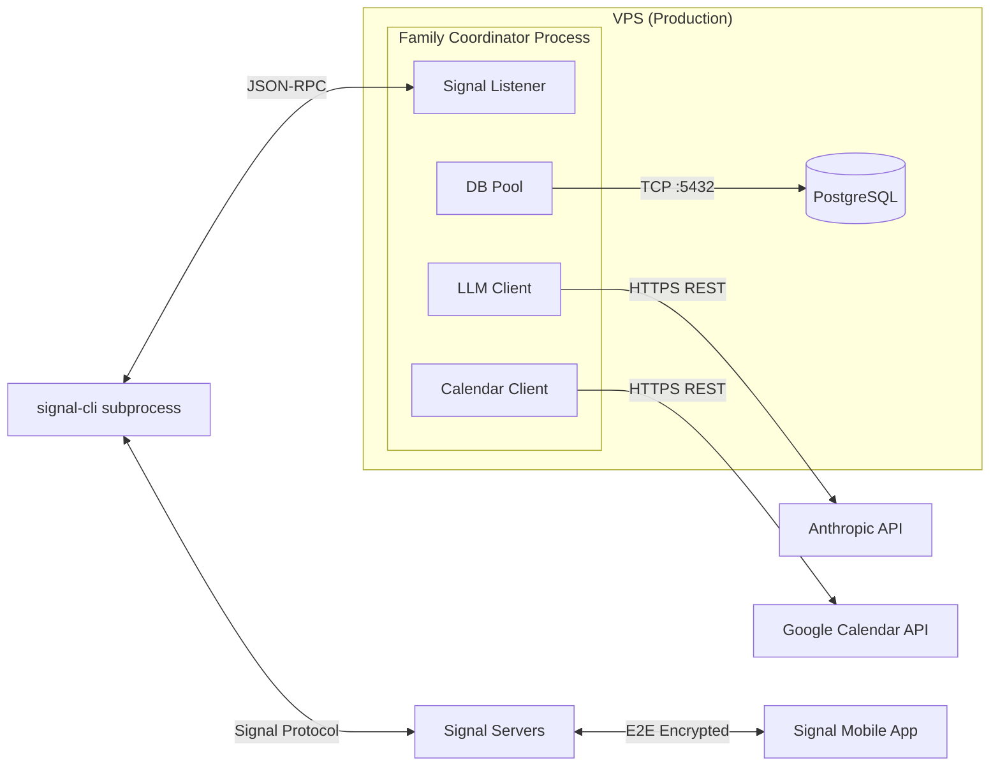

# 3. Context and Scope

## 3.1 Business Context

Family members interact with the bot through Signal messenger. The bot understands German natural language, extracts calendar intent via Claude LLM, and performs CRUD operations on a shared Google Calendar.

| Communication Partner | Input                                | Output                                         |
| --------------------- | ------------------------------------ | ---------------------------------------------- |
| Family members        | Natural language messages via Signal | Calendar confirmations/queries in German       |
| Google Calendar       | Event CRUD requests via API          | Event data, conflict information               |
| Claude LLM            | User message + conversation history  | Structured intent with entities and confidence |

## 3.2 Technical Context

| Channel          | Protocol                                                | Format                                        |
| ---------------- | ------------------------------------------------------- | --------------------------------------------- |
| Signal messaging | Signal Protocol (E2E encrypted) via signal-cli JSON-RPC | Text messages                                 |
| Anthropic API    | HTTPS REST                                              | JSON (tool use with structured output)        |
| Google Calendar  | HTTPS REST                                              | JSON (Google Calendar API v3)                 |
| PostgreSQL       | TCP                                                     | pg wire protocol (connection pooling, max 10) |
| Health check     | HTTP                                                    | JSON on port 3000 (`GET /health`)             |
