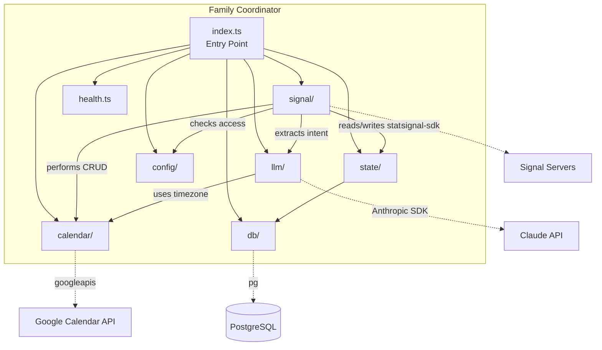

# 5. Building Block View

## 5.1 Level 1 -- System Overview

| Building Block | Purpose                                              | Key Files                                                                              |
| -------------- | ---------------------------------------------------- | -------------------------------------------------------------------------------------- |
| `signal/`      | Signal message receive/send and processing pipeline  | `src/signal/listener.ts`, `src/signal/client.ts`, `src/signal/sender.ts`               |
| `llm/`         | Natural language intent extraction via Claude        | `src/llm/intent.ts`, `src/llm/prompts.ts`, `src/llm/types.ts`                          |
| `calendar/`    | Google Calendar CRUD, conflicts, recurring, timezone | `src/calendar/operations.ts`, `src/calendar/conflicts.ts`, `src/calendar/recurring.ts` |
| `state/`       | Conversation state and idempotency persistence       | `src/state/conversation.ts`, `src/state/idempotency.ts`                                |
| `config/`      | Environment validation, constants, family whitelist  | `src/config/env.ts`, `src/config/constants.ts`, `src/config/family-members.ts`         |
| `db/`          | PostgreSQL connection pool and migrations            | `src/db/pool.ts`, `src/db/migrate.ts`, `src/db/migrations/*.sql`                       |
| `utils/`       | Shared utilities (logger, error classes)             | `src/utils/logger.ts`, `src/utils/errors.ts`                                           |
| `health.ts`    | HTTP health check endpoint for monitoring            | `src/health.ts`                                                                        |

## 5.2 Level 2 -- Module Details

### Signal Module (`src/signal/`)

**Purpose:** Receives incoming Signal messages, orchestrates the full processing pipeline, and sends responses back through Signal.

**Key files:**

- `src/signal/listener.ts` -- Core message processing pipeline: receive, deduplicate, authorize, extract intent, handle calendar operations, send response. This is the main orchestration logic of the entire system (893 lines).
- `src/signal/client.ts` -- Factory for creating a configured signal-sdk `SignalCli` instance with rate limiting and concurrency controls.
- `src/signal/sender.ts` -- Wrapper around signal-sdk's `sendMessage` with error handling and logging.
- `src/signal/types.ts` -- TypeScript interfaces for Signal message envelopes and data messages.

**Interfaces:**

- Exports: `setupMessageListener()`, `MessageListenerDeps` interface
- Dependencies: All other modules (llm, calendar, state, config)

### LLM Module (`src/llm/`)

**Purpose:** Extracts structured calendar intent from German natural language messages using Claude's tool use feature.

**Key files:**

- `src/llm/intent.ts` -- Calls Claude API with a tool definition (`parse_calendar_intent`) that forces structured JSON output. Includes prompt caching via `cache_control: { type: "ephemeral" }` for 90% cost reduction on cache hits. Validates output with Zod.
- `src/llm/prompts.ts` -- System prompt in German (~270 lines) defining intent types, entity extraction rules, date/time resolution logic, recurring event patterns, and examples.
- `src/llm/types.ts` -- TypeScript interfaces and Zod schemas for `CalendarIntent`, `CalendarEntities`, `RecurrenceEntities`.
- `src/llm/client.ts` -- Factory for creating an Anthropic SDK client.

**Interfaces:**

- Exports: `extractIntent()`, `CalendarIntent`, `CalendarIntentSchema`
- Dependencies: `@anthropic-ai/sdk`, Luxon, config/constants

### Calendar Module (`src/calendar/`)

**Purpose:** All Google Calendar interactions -- CRUD operations, conflict detection, recurring event management, and timezone-aware date/time formatting.

**Key files:**

- `src/calendar/operations.ts` -- CRUD functions: `listEvents()`, `findEvents()`, `createEvent()`, `createAllDayEvent()`, `createRecurringEvent()`, `updateEvent()`, `deleteEvent()`. All functions accept a `CalendarClient` and return typed results.
- `src/calendar/conflicts.ts` -- `findConflicts()` checks for time overlaps before event creation. Excludes all-day events from conflict detection.
- `src/calendar/recurring.ts` -- `formatRRule()` generates RFC 5545 RRULE strings. `calculateNextOccurrences()` computes future dates. `trimRecurringEvent()` handles "delete all future" by modifying UNTIL.
- `src/calendar/timezone.ts` -- Timezone-aware utilities: `inferEventDate()`, `createEventDateTime()`, `formatEventTime()`, `formatDayName()`. All use Luxon with IANA timezones.
- `src/calendar/client.ts` -- Factory for Google Calendar API client with service account auth and retry config.
- `src/calendar/types.ts` -- Domain types: `CalendarEvent`, `CreateEventInput`, `UpdateEventInput`, `EventSearchResult`, `CalendarError`.

**Interfaces:**

- Exports: All CRUD functions, timezone utilities, type definitions
- Dependencies: `googleapis`, Luxon

### State Module (`src/state/`)

**Purpose:** PostgreSQL-backed persistence for conversation state (multi-turn flows) and message idempotency (deduplication).

**Key files:**

- `src/state/conversation.ts` -- `ConversationStore` class with `getState()`, `saveState()`, `clearState()`, `addToHistory()`. Sessions expire after 30 minutes of inactivity (enforced via SQL `WHERE` clause). Message history auto-trims to 5 entries.
- `src/state/idempotency.ts` -- `IdempotencyStore` class with `isProcessed()`, `markProcessed()`, `cleanup()`. Prevents duplicate processing of Signal messages. Records retained 7 days.
- `src/state/types.ts` -- `ConversationState` and `MessageHistoryEntry` interfaces.

**Interfaces:**

- Exports: `ConversationStore`, `IdempotencyStore`, state type definitions
- Dependencies: `pg` (Pool)

### Config Module (`src/config/`)

**Purpose:** Centralized configuration management -- environment validation, application constants, and family member access control.

**Key files:**

- `src/config/env.ts` -- Zod schema validating all required environment variables. Exits process on validation failure.
- `src/config/constants.ts` -- Application constants: session TTL (30 min), message retention (7 days), max history (5 messages), Signal rate limits, help text in German.
- `src/config/family-members.ts` -- Loads `family-members.json`, validates with Zod, normalizes phone numbers to E.164. `FamilyWhitelist` class provides O(1) lookup by phone or UUID.

**Interfaces:**

- Exports: `validateEnv()`, constants, `FamilyWhitelist`, `loadFamilyConfig()`
- Dependencies: Zod, `libphonenumber-js`

### Database Module (`src/db/`)

**Purpose:** PostgreSQL connection pool management and schema migrations.

**Key files:**

- `src/db/pool.ts` -- Creates a `pg.Pool` with max 10 connections from `DATABASE_URL`. Exports `pool` and `closePool()`.
- `src/db/migrate.ts` -- Reads and executes SQL files from `src/db/migrations/` in sorted order. Can be run directly or imported.
- `src/db/migrations/001_init.sql` -- Creates `conversations` and `message_log` tables.
- `src/db/migrations/002_idempotency.sql` -- Creates `processed_messages` table.
- `src/db/migrations/003_widen_phone_columns.sql` -- Widens phone columns to VARCHAR(40) for Signal UUID support.

**Interfaces:**

- Exports: `pool`, `closePool()`, `runMigrations()`
- Dependencies: `pg`
