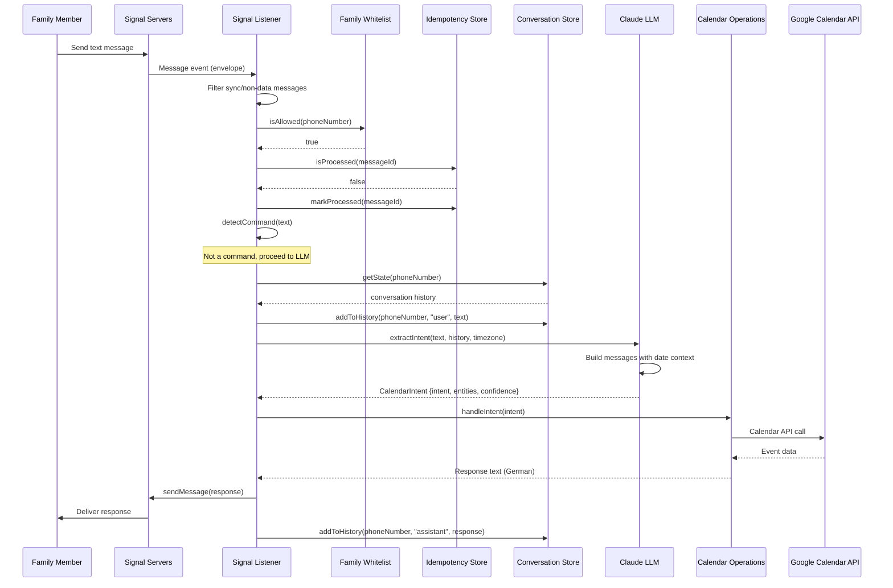
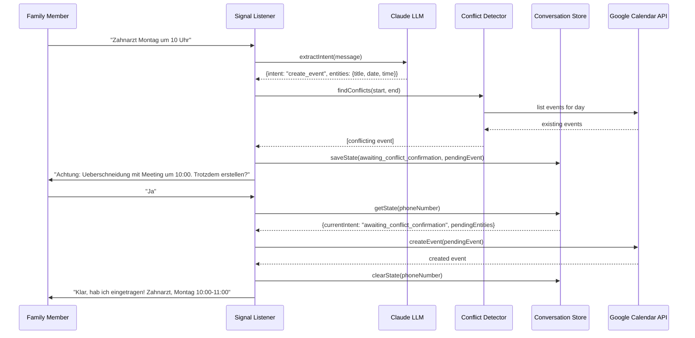
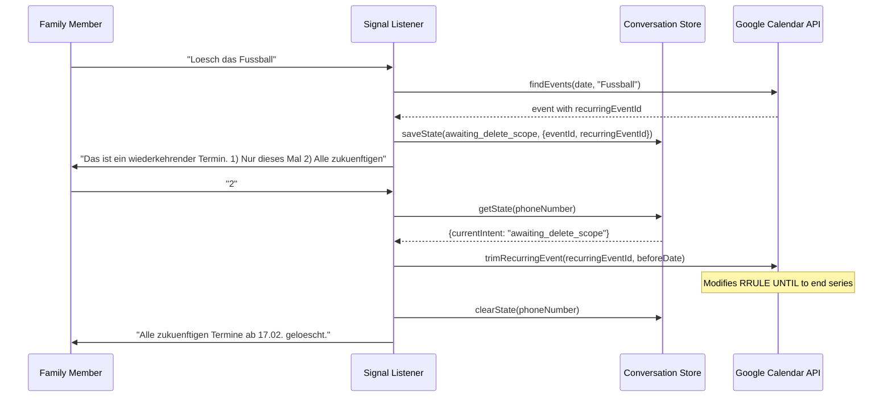

# 6. Runtime View

## 6.1 Message Processing Pipeline (Primary Flow)

The main runtime scenario: a family member sends a message, the bot extracts intent, performs a calendar operation, and responds.

## 6.2 Conflict Detection and Confirmation Flow

When creating an event that overlaps with existing events, the bot asks for confirmation before proceeding.

## 6.3 Recurring Event Delete Scope Flow

When deleting a recurring event instance, the bot asks whether to delete just that instance or all future instances.

## 6.4 Startup and Shutdown

**Startup sequence** (in `src/index.ts`):

1. Validate environment variables via Zod schema (`src/config/env.ts`)
2. Load and validate family member whitelist from `family-members.json`
3. Create service instances: Signal client, Anthropic client, Calendar client, ConversationStore, IdempotencyStore
4. Run idempotency cleanup (delete records older than 7 days)
5. Connect to Signal via signal-cli subprocess
6. Register message event listener with all dependencies
7. Start HTTP health check server on port 3000

**Graceful shutdown** (SIGTERM/SIGINT handlers):

1. Stop health check HTTP server
2. Gracefully shut down Signal client (stops signal-cli)
3. Close PostgreSQL connection pool
4. Exit process with code 0 (or 1 on error)
