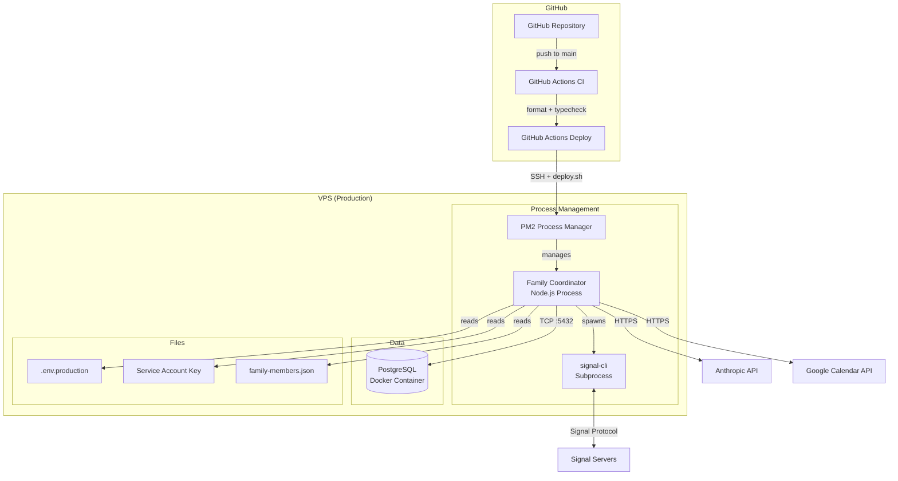

# 7. Deployment View

## 7.1 Infrastructure

## 7.2 Environments

| Environment | Purpose     | Infrastructure                                                                     |
| ----------- | ----------- | ---------------------------------------------------------------------------------- |
| Development | Local dev   | `npm run dev` with tsx watch, local PostgreSQL (Docker, port 5433), `.env`         |
| Production  | Live system | VPS at `/opt/family-coordinator`, PM2 daemon, Docker PostgreSQL, `.env.production` |

## 7.3 Deployment Process

Deployment is fully automated via GitHub Actions (`.github/workflows/deploy.yml`):

1. **Trigger:** Push to `main` branch or manual workflow dispatch
2. **Concurrency:** Serial deployments (cancel-in-progress: false)
3. **SSH into VPS:** Uses `appleboy/ssh-action` with SSH key authentication
4. **Run `scripts/deploy.sh`:**
   - `git pull --ff-only` -- Pull latest code
   - `npm ci --omit=dev` -- Install production dependencies
   - `tsx --env-file=.env.production src/db/migrate.ts` -- Run database migrations
   - `pm2 restart ecosystem.config.cjs` -- Restart or start the application
   - `pm2 save` -- Persist PM2 process list
   - Health check verification via `curl http://localhost:3000/health`
5. **Post-deploy verification:** SSH back in to check PM2 status and health endpoint

### PM2 Configuration (`ecosystem.config.cjs`)

- Interpreter: `tsx` with `--env-file=.env.production`
- Single instance, fork mode
- Auto-restart enabled with max 10 restarts
- Memory limit: 500MB
- Min uptime: 30 seconds (prevents restart loops)
- Restart delay: 5 seconds between restart attempts
- Logs: `./logs/error.log` and `./logs/output.log`

### Database Backups (`scripts/backup.sh`)

- Daily PostgreSQL backup via `pg_dump` + gzip
- 7-day retention policy
- Designed for cron scheduling: `0 2 * * *`

## 7.4 CI Pipeline

Three GitHub Actions workflows:

1. **CI** (`.github/workflows/ci.yml`): Runs on push/PR to main
   - Format check (`prettier --check`)
   - Type check (`tsc`)
   - Test job exists but is currently commented out

2. **Deploy** (`.github/workflows/deploy.yml`): Runs on push to main
   - SSH-based deployment to VPS
   - Health check verification

3. **Dependency Review** (`.github/workflows/dependency-review.yml`): Runs on PRs that change `package.json` or `package-lock.json`
   - Fails on moderate+ severity vulnerabilities
   - Posts summary comment on PR
